# 电商用户行为与增长分析报告

> **数据窗口**：2025-06-02 ~ 2025-08-31（13 个自然周，91 天）
> **数据规模**：10,000 注册用户 / 3,000 商品 / 866,000+ 行为记录 / 6,299 笔订单 / GMV ¥154.7 万
> **工具链**：MySQL 8（存储与 SQL 分析）→ Python 3（pandas/scipy/sklearn/matplotlib）→ 可视化（pyecharts HTML 看板 / Tableau Public）
> **数据说明**：真实电商行为数据不可公开，本项目采用行业经验参数化生成模拟数据，业务规律（渠道质量差异、新客活跃衰减、购买冷却、A/B 干预等）内置并可复现；所有分析流程与真实生产一致。

---

## 1. 大盘概览：生意的基本面

| 指标 | 数值 | 口径 |
|---|---|---|
| 浏览用户 / 总浏览(PV) | 9,986 人 / 67.7 万 | 窗口去重 |
| 日均活跃(DAU) | 2,583 | 有浏览行为用户 / 日 平均 |
| 支付买家 | 3,714 人（注册用户渗透 37.1%） | 窗口内至少 1 单 |
| 订单量 / GMV | 6,299 笔 / ¥154.7 万 | 实付口径 |
| 客单价 | ¥245.6 | GMV ÷ 订单 |
| 浏览→支付（累计用户口径） | 37.2% | 支付用户 ÷ 浏览用户 |
| 复购渗透率（≥2 单） | 41.3% | 复购买家 ÷ 买家 |

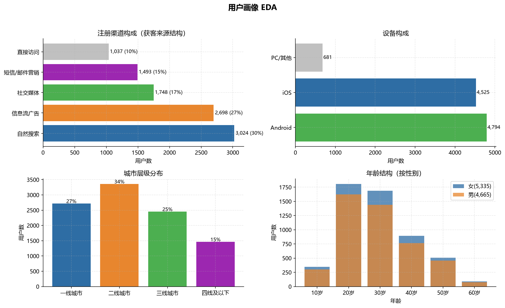
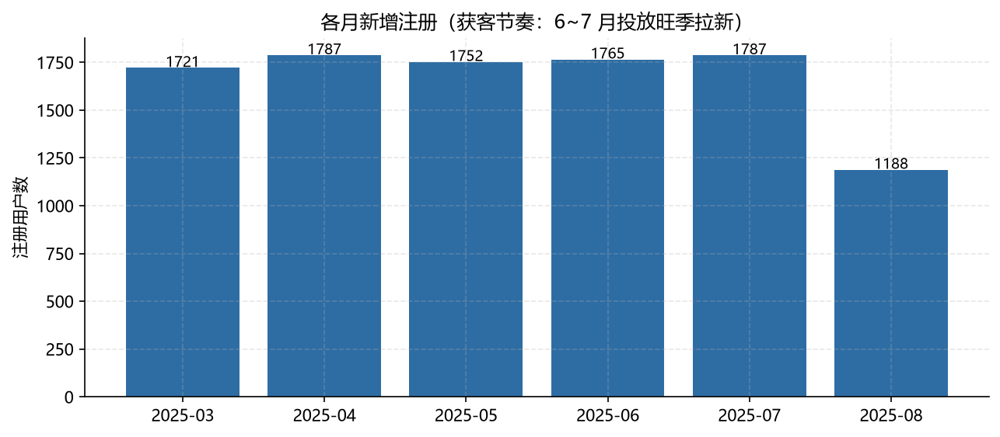
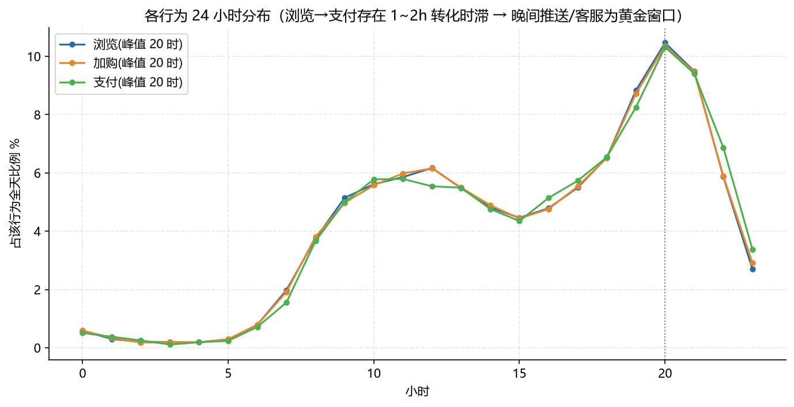

**小时规律**：浏览/加购/支付峰值集中在 20~21 时（晚间黄金窗口），支付行为相对浏览有 1~2 小时转化时滞 → 晚间推送、客服与直播排期应向 19~22 时倾斜。

---

## 2. 转化漏斗：问题不在"不来"，在"加购了不付"

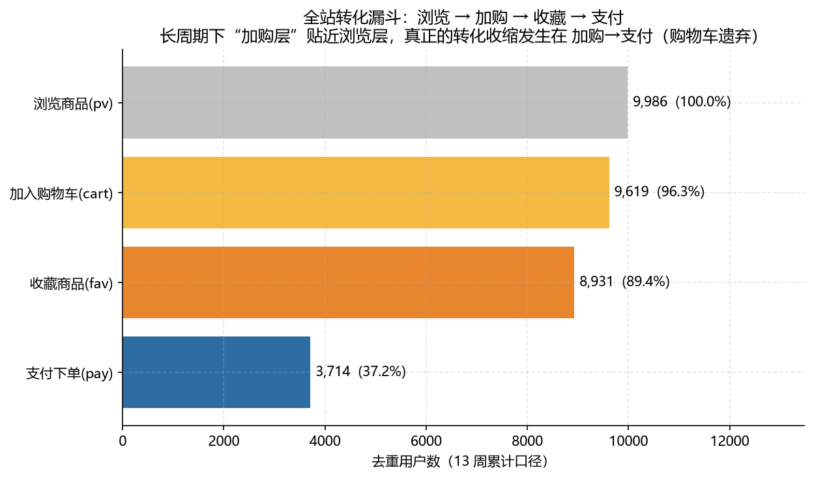
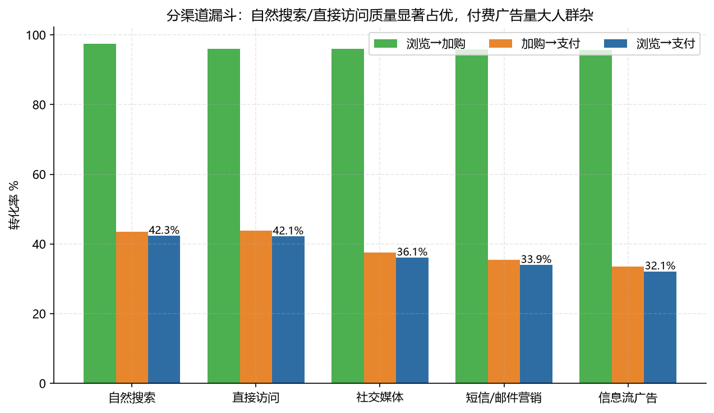

- 13 周累计口径下，浏览→加购层高达 96%（说明流量质量与商品吸引力尚可、用户愿意表达意向）；
- **真正的塌陷在加购→支付：仅 38.6%**（3,714 / 9,619），即约 60% 的加购用户最终未成交 —— 典型"购物车遗弃"；
- 分渠道看漏斗收窄速度差异明显：自然搜索 / 直接访问的浏览→支付 42%+，信息流广告仅 32% —— 广告带来了量，但人群意图杂、承接差；
- 按设备看三者接近（37%±），PC 用户略占优，无显著设备短板。

**业务指向**：转化提升的主战场 = 购物车挽回与支付环节（券、提醒、支付失败挽回），而不是继续买量。

---

## 3. 留存：新客热情衰减是最主要的结构性问题

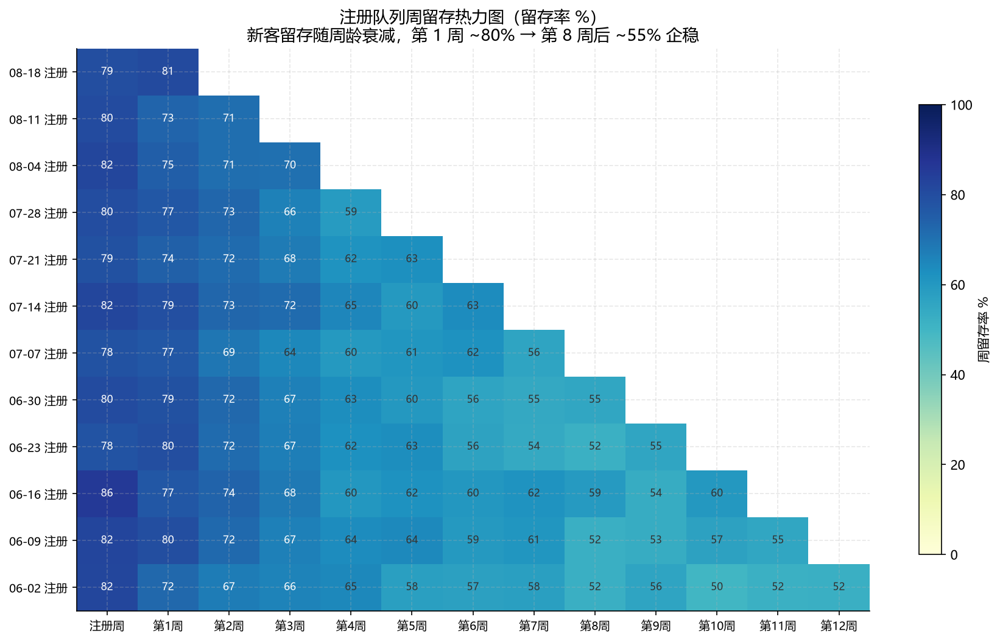
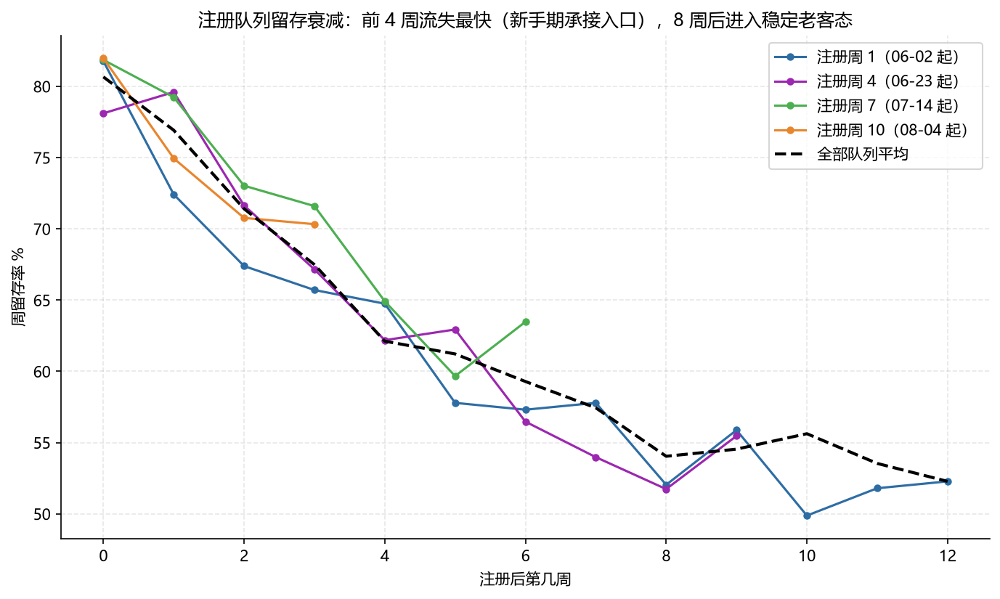

- 各注册周队列的留存曲线形态一致：**注册当周活跃 78~85% → 第 4 周约 65% → 第 8 周后稳定在 55% 左右**；
- 前 4 周流失斜率最陡：新客的"活跃红利"快速衰减，之后进入老客稳态；
- 对比行为队列留存（存量活跃用户周与周之间保持 80%+）说明：**留存问题的本质是"新客转老客"的漏斗漏损，存量基本盘黏性健康**。

**业务指向**：新客注册后 0~30 天是决定"去留"的关键窗口，对应运营设计：注册后引导首单、7/15/30 天任务式召回、次日与次周 Push 触点。

---

## 4. RFM 分层：GMV 高度依赖"近流失高价值用户"

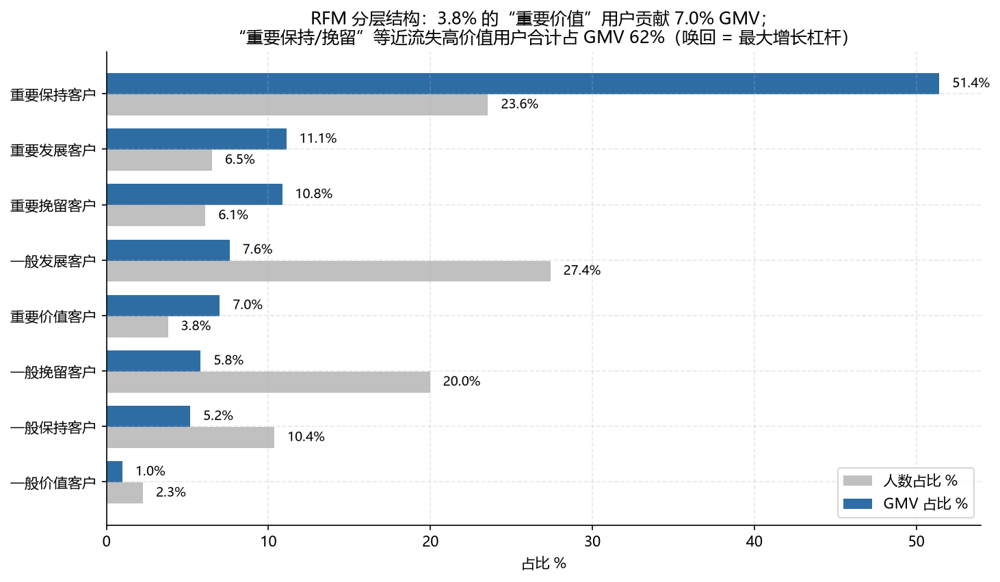
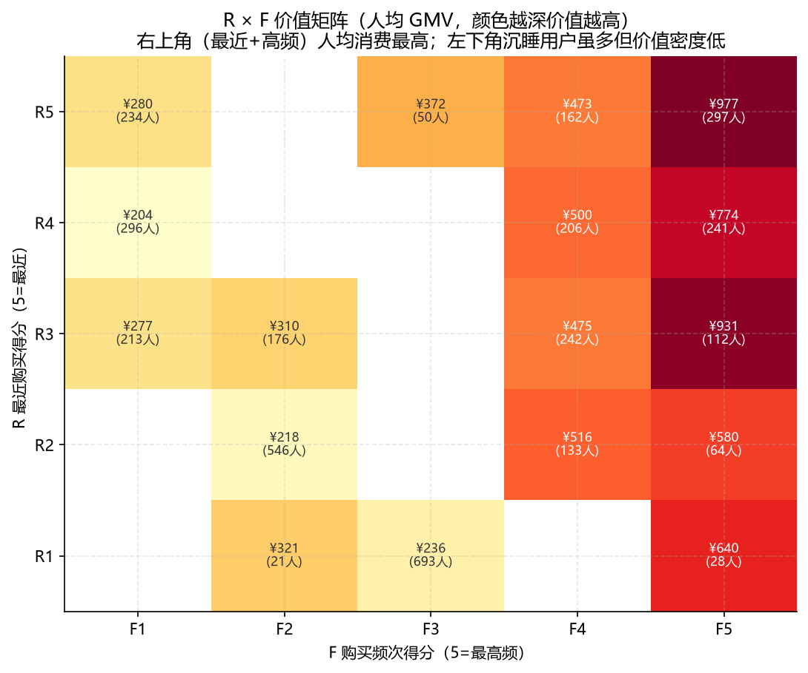

| 分层 | 人数占比 | GMV 占比 | 人均 GMV | 运营动作 |
|---|---|---|---|---|
| 重要保持客户（高频·近流失） | 23.6% | **51.4%** | ¥909 | 召回优先级最高：券+专属客服 |
| 重要发展/挽留客户 | 12.6% | 22.0% | ¥710~739 | 定向唤回，防流失 |
| 一般发展/挽留客户 | 47.4% | 13.4% | ¥116~121 | 培养复购习惯，慎用高成本券 |
| 重要价值客户（健康高频高额） | 3.8% | 7.0% | ¥768 | 维持服务，会员体系沉淀 |

**核心洞察**：约 40% 的"重要"买家贡献 **80.4% GMV**；其中最大的一块（保持+挽留，30% 买家、62% GMV）正处于**沉睡/流失边缘** —— 理论上若通过召回使其中 20% 恢复活跃，可撬动约 12% GMV（≈¥19 万/季度）。

---

## 5. 复购：间隔 8~30 天是二次购买的运营窗口

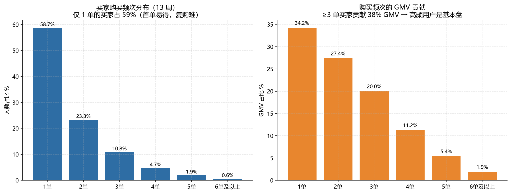
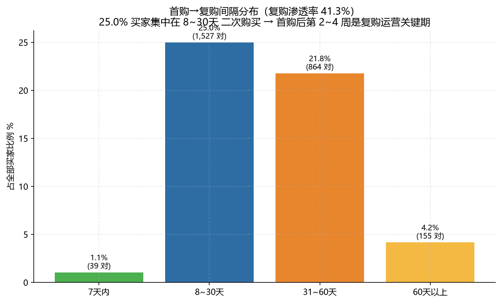

- 单次购买买家占 58.7%（但仅贡献 34% GMV）；41.3% 买家会复购，其中 4 单以上高价值用户贡献突出；
- **首购→复购间隔峰值出现在 8~30 天**（约 25% 的买家），而非 7 天内 —— 说明存在自然的"购买冷却"（客单价 ¥245 的商品决策周期约 2~4 周），**7 天内不应高频骚扰，第 2~4 周投放复购券 / 新品推荐效果最好**；
- 复购用户平均复购 1.7 次，平均首复购间隔 33.7 天 → 复购节律可支撑"月度会员日"式运营。

---

## 6. 渠道效率：免费渠道少而精，广告预算需再配置

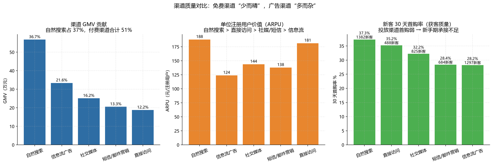
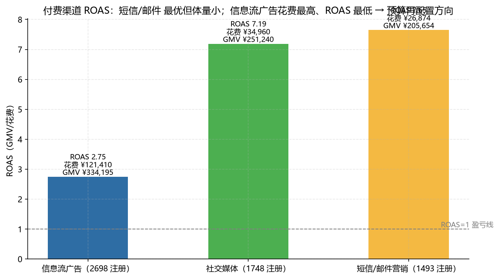

- **GMV 结构**：自然搜索 36.7% > 信息流广告 21.6% > 社媒 16.2% > 短信 13.3% > 直接访问 12.2%；
- **质量排序**（付费渗透率 / ARPU / 新客 30 天首购率）：自然搜索、直接访问明显优于三个付费渠道；信息流广告新客 30 天首购率仅 28.2%（付费渠道最低）；
- **投放效率**：信息流花费 ¥12.1 万 ROAS 2.75；社媒 ¥3.5 万 ROAS 7.19；短信 ¥2.7 万 ROAS 7.65 —— 信息流拿了 70% 预算却效率垫底；
- **建议**：信息流预算向社媒/短信或自然搜索的 SEO 内容再分配 20~30%，并以"新客 30 天首购率 + ROAS"作为投放周报北极星组合。

---

## 7. A/B 实验：新客券显著提升转化，但 GMV 增量不显著

实验设计：6/2~7/31 注册新客随机 50/50 分 A/B（A=1,805 / B=1,683），8/1~8/17 向 B 组发放"满 49 减 8~20 元新客券"。

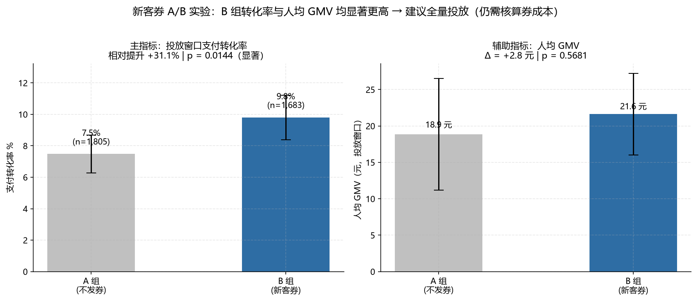

| 检验 | 结果 |
|---|---|
| 随机化校验（实验前转化率 A 28.7% vs B 30.4%） | p=0.281，**组间基线可比 ✓** |
| 主指标：投放窗口支付转化率 A 7.5% vs B 9.8% | **相对提升 +31.1%，p=0.014，95%CI 显著 ✓** |
| 辅助：人均 GMV A ¥18.9 vs B ¥21.6 | Δ=+¥2.8，p=0.57，**不显著** |
| 成本：券核销 ¥1,104；GMV 增量估算 ≈ ¥4,653 | 券 ROI ≈ 4.2 |

**严谨的结论（不只报喜）**：券显著拉高了"下单动作"，但人均金额增量不显著 —— 提示转化提升主要来自**低价小额冲动单**，而非客单提升；叠加券成本后，**对 GMV/利润口径的净收益需谨慎**。建议：
1. 下一轮实验加入"满 99 减 15"对照组，检验"提客单"型券；
2. 用券用户做 90 天 LTV 跟踪（当前实验只覆盖 17 天窗口）；
3. 全量上线前先对"购物车用户"定向小流量灰度。

---

## 8. 用户流失预警模型：预测"下月不再下单"的买家

建模口径：特征窗 6/2~7/27 有成交的 2,888 名买家；标签 = 7/28~8/31 是否再下单（流失率 61.6%）。

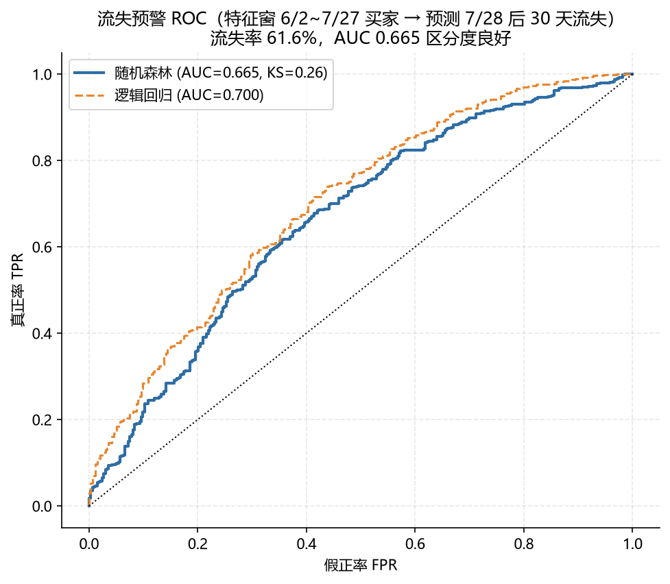
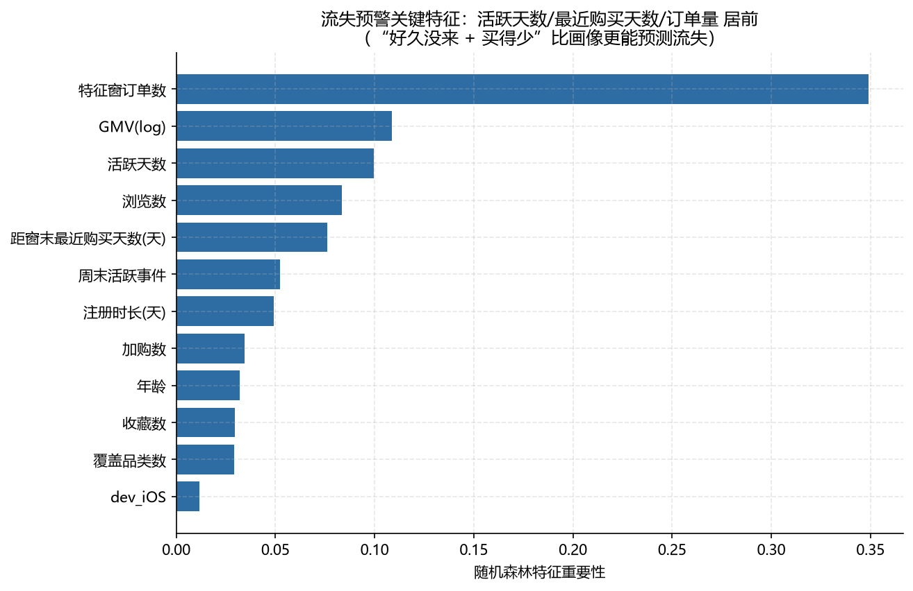
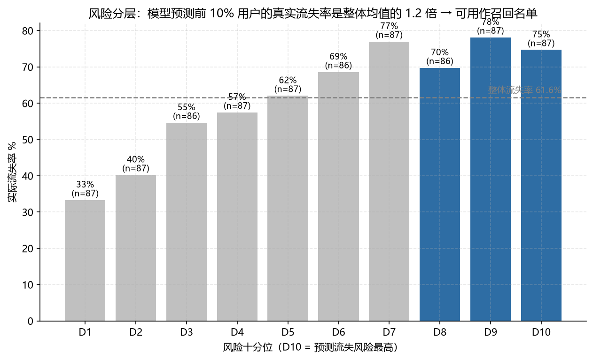

- **逻辑回归 AUC 0.700 / KS 0.30**，随机森林 AUC 0.665（数据量与特征有限，LR 更稳）；
- 特征重要性 TOP：**活跃天数、距窗末最近购买天数、特征窗订单量** —— "多久没来 + 买得多不多"是比画像（年龄/城市）强得多的流失信号；
- **业务分层**：模型预测最高风险十分位的实际流失率 75%，最低分位仅 33%；
- **交付**：输出 Top300 高危召回名单（`output/model/risk_top300.csv`），名单精度 86%，可直接交运营做定向 PUSH/券召回 —— 相比 RFM 事后分层，模型可"提前 1 个月"预警；
- 模型文件已序列化（`output/model/churn_model.pkl`），支持定期重训与上线打分。

---

## 9. 结论与行动优先级

| 优先级 | 行动 | 预期杠杆 | 依据 |
|---|---|---|---|
| P0 | 新客 0~30 天留存运营体系（首单引导+30 天触点） | 新客 4 周留存 65%→75%+ | §3 留存曲线 |
| P0 | 购物车遗弃挽回（支付提醒+定向券） | 加购→支付 38.6%→45%+ | §2 漏斗 |
| P1 | 重要保持/挽留用户召回（RFM 名单 + 模型名单交叉） | 撬动约 12% GMV | §4/§8 |
| P1 | 信息流预算再配置 & 渠道周报化 | ROAS 提升空间 ~2 倍 | §6 |
| P2 | 复购券窗口定在首购后 8~30 天 | 复购渗透 41%→50%+ | §5 |
| P2 | A/B 平台常态化（提客单券实验已排队） | 转化 +31% 经验可复制 | §7 |

---

## 10. 口径与局限（体现严谨的部分）

1. **模拟数据**：业务规律参数化生成（生成脚本 `scripts/01_generate_data.py`），结论代表"方法论的完整演练"，不宣称真实市场数据；
2. **归因口径**：GMV 按用户注册渠道首触归因，未建模多触点路径；
3. **ROAS** 按"窗口 GMV ÷ 累计获客成本"估算，未扣商品成本与履约成本（毛利口径需另行测算）；
4. **RFM 窗口**为 13 周累计（长窗口分层更稳，但对新客不敏感，新客单独用注册周龄分层）；
5. **A/B 金额指标不显著**部分受样本量与金额右偏影响，结论以转化率为主指标并做了多指标交叉验证；
6. 流失模型标签窗口 5 周偏短，"30 天未购"与"永久流失"之间存在灰色地带，上线需监控误召回成本。

---

*报告全文由 `sql/analysis/*.sql` + `analysis/*.py` 自动化产出，重新运行即可复现所有图表与数字。*
